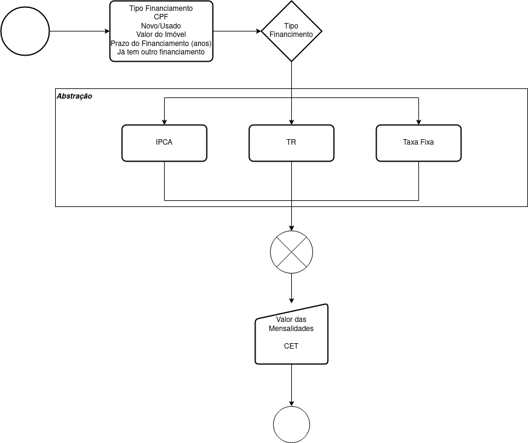
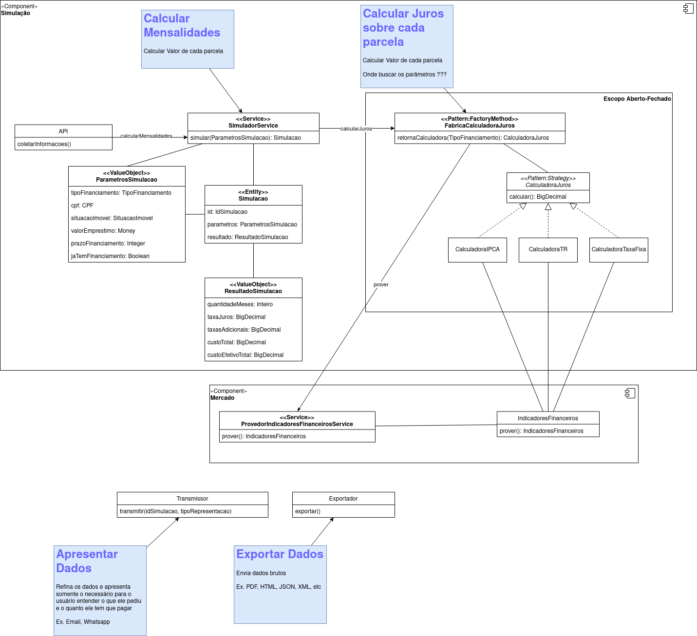

# unipar-2021-aula-2

## Descrição

O objetivo do projeto é implementar um simulador de empréstimos onde o usuário informará as informações básicas e as condições serão calculadas pelo sistema.

## Glossário

**Tipo Financiamento:**
- ***IPCA:*** Corrigido de acordo com a inflação + 1%.
- ***TR:*** A soma da Taxa Referencial (atualmente zerada) mais 70% do IPCA
- ***Taxa Fixa:*** Taxa anual constante

**Score Credito:** Pontuação de crédito de acordo com o Serasa

**CET:** Custo Efetivo Total do empréstimos, ou seja, o total de juros anuais + seguro + taxas de manutenção

## Modelos

### Processo de Simulação

### Modelo de domínio detalhado

